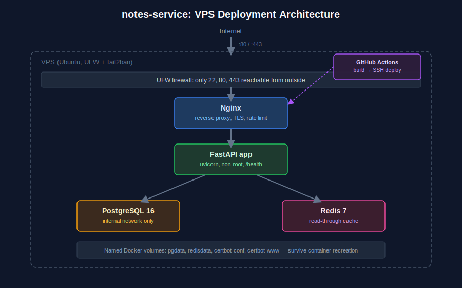

# Architecture

## Request flow

1. A request hits the VPS on port 80/443. UFW only allows traffic through
   on 22, 80, 443 - nothing else is reachable from outside.
2. Nginx terminates TLS (once a cert is configured, see `ssl.md`), applies
   rate limiting, and proxies to the FastAPI app over the internal Docker
   network on port 8000. The app container is never exposed to the host
   directly - only nginx talks to it.
3. The FastAPI app handles the request. For reads, it checks Redis first;
   on a miss, it queries Postgres and populates the cache with a short TTL.
   For writes, it writes to Postgres and invalidates the relevant cache key.
4. Postgres and Redis are reachable only from other containers on the
   compose network - no host port mapping for either, so they're not
   reachable from outside the VPS even if someone got past nginx.

## Deploy flow

GitHub Actions builds and smoke-tests the image on every push. On a push to
`main`, it SSHes into the VPS using a scoped deploy key and runs
`scripts/deploy.sh`, which pulls the latest code, rebuilds just the `app`
image, restarts only that container, and gates success on `/health`
actually returning OK before declaring the deploy done.

## Why these specific pieces

- **Nginx in front of uvicorn** rather than exposing uvicorn directly:
  nginx handles TLS termination and rate limiting in one place, and keeps
  the app server simple. It's also the natural place to add a second app
  replica later for zero-downtime deploys without touching the app code.
- **Redis as cache, not session store or queue**: kept its role narrow on
  purpose. A cache that's just a cache can be flushed at any time with zero
  data-loss risk, which keeps operational reasoning simple.
- **Named volumes, not bind mounts, for pgdata/redisdata**: volumes are
  managed by Docker and survive `docker compose down` (without `-v`),
  whereas a bind mount to a host path is easy to accidentally point at the
  wrong place across environments. Bind mounts are still used for config
  files (`nginx/default.conf`) where I want host-edits to take effect
  immediately on container restart, which is the opposite of what I want
  for the database's actual data.
